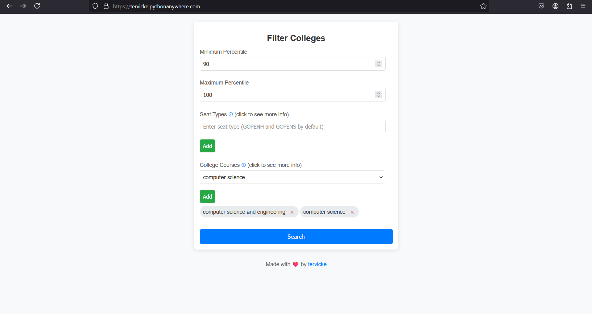
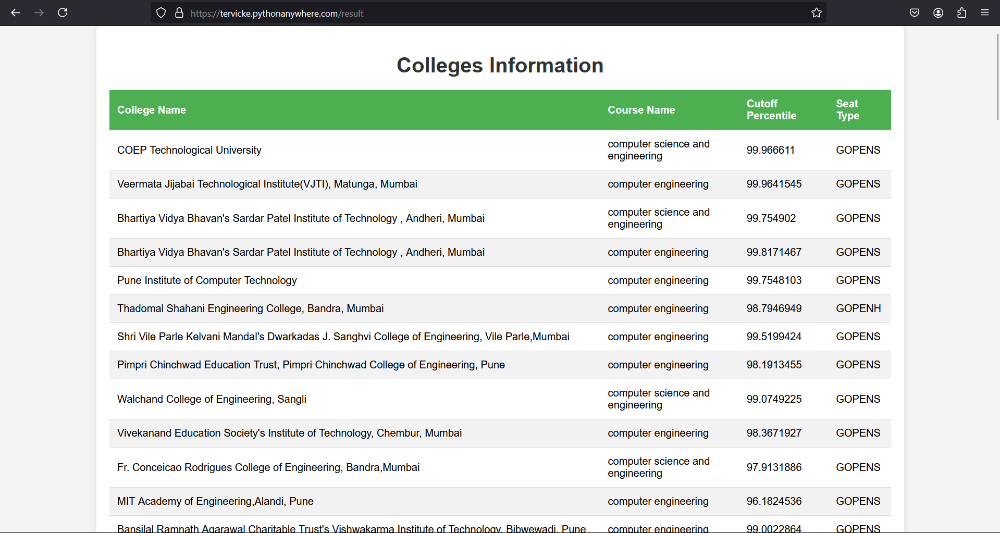

# CET College Search

## About
This is a simple project I made to to filter/search [CET](https://cetcell.mahacet.org/) based colleges , with multiple filters like min max percentile , branches/courses etc. It uses flask as the backend and simple html , css , js . Its hosted on pythonanywhere and you can check it out [here](https://tervicke.pythonanywhere.com/) .

### [reddit post about this project](https://www.reddit.com/r/mht_cet/comments/1f0pc0p/made_a_tool_for_all_the_upcoming_students/)

## Screenshots



## Running Locally
To run the project locally you will have to create a file test (not extension) in the project directory , this way it the code will know that its on testing and would not try to use the absolute path (for pythonanywhere) . Once the file is created you are set to go , just do a 
```bash
python3 app.py
```
this will run the flask app locally . 
